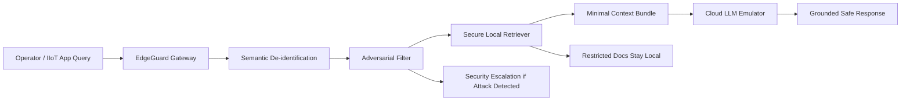

# EdgeGuard: Adaptive Privacy-Preserving Gateway Simulation

This project is a presentation-ready simulation of the proposed BTech final-year project:

**EdgeGuard: An Adaptive Privacy-Preserving Gateway for Secure Industrial LLM Integration**

The simulation is grounded in:

- `LLM-Based Edge Intelligence: A Comprehensive Survey on Architectures, Applications, Security and Trustworthiness` (Friha et al., 2024)
- The supplied thematic literature review on prompt injection defense, privacy-aware RAG, and edge gateway security

## Objective

EdgeGuard demonstrates how an industrial organization can safely use a powerful cloud LLM without sending raw plant data or exposing the model directly to adversarial prompts.

## Core Layers

1. **Semantic De-identification**
   Masks machine serials, employee IDs, formula references, and similar sensitive identifiers before cloud transmission.
2. **Adversarial Input Filtering**
   Detects prompt injection, policy bypass attempts, and bulk exfiltration language at the gateway.
3. **Local Contextualization with Secure RAG**
   Retrieves only the minimum local SOP context permitted for the requesting role and prevents access to restricted documents.

## Simulated Architecture



## Project Structure

- [run_simulation.py](C:\Users\nisar\Documents\Codex\2026-04-22-files-mentioned-by-the-user-llm\run_simulation.py)
- [edgeguard_sim\data.py](C:\Users\nisar\Documents\Codex\2026-04-22-files-mentioned-by-the-user-llm\edgeguard_sim\data.py)
- [edgeguard_sim\gateway.py](C:\Users\nisar\Documents\Codex\2026-04-22-files-mentioned-by-the-user-llm\edgeguard_sim\gateway.py)
- [edgeguard_sim\rag.py](C:\Users\nisar\Documents\Codex\2026-04-22-files-mentioned-by-the-user-llm\edgeguard_sim\rag.py)
- [edgeguard_sim\simulation.py](C:\Users\nisar\Documents\Codex\2026-04-22-files-mentioned-by-the-user-llm\edgeguard_sim\simulation.py)

## Demo Scenarios

- Normal operational query on boiler pressure
- Maintenance query containing sensitive identifiers
- Prompt injection attack
- Data exfiltration attack
- Security policy assistance request
- Mixed benign + malicious prompt

## How to Run

```powershell
C:\Users\nisar\.cache\codex-runtimes\codex-primary-runtime\dependencies\python\python.exe run_simulation.py
```

## What the Demo Produces

After execution, the simulation writes:

- `outputs/simulation_results.json`
- `outputs/simulation_report.md`

These are useful for your next two steps:

- report writing
- presentation slide creation

## Suggested Presentation Story

1. Start with the industrial problem: cloud LLMs are powerful but risky for privacy and security.
2. Show the three-layer EdgeGuard gateway.
3. Compare direct cloud usage vs EdgeGuard on six scenarios.
4. Highlight blocked attacks, redacted data, and grounded responses.
5. Conclude that EdgeGuard gives a practical hybrid architecture instead of choosing only edge-only or cloud-only AI.

## Interactive App

This workspace also includes a new browser-based EdgeGuard app with:

- a polished dashboard UI
- live query processing through the gateway
- threat scoring and pipeline visualization
- approved document retrieval panels
- an OpenAI-compatible backend connector with offline fallback

Run it with:

```powershell
C:\Users\nisar\.cache\codex-runtimes\codex-primary-runtime\dependencies\python\python.exe run_edgeguard_app.py
```

Then open:

```text
http://127.0.0.1:8080
```

If you want a live LLM backend, create a local `.env` or set environment variables using [.env.example](C:\Users\nisar\Documents\Codex\2026-04-22-files-mentioned-by-the-user-llm\.env.example).
